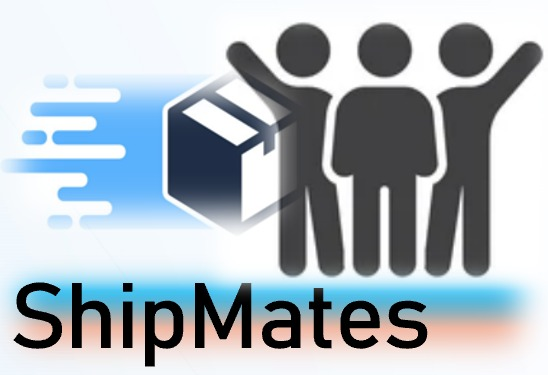
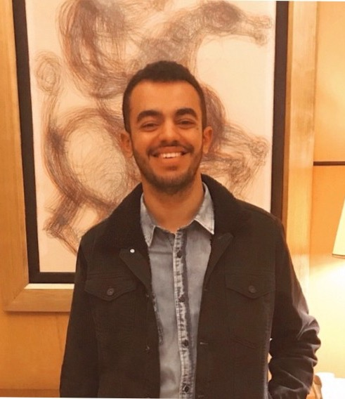

## Welcome to ShipMates

ShipMates offers a platform which connects users shopping online enabling them to split the shipping fees for their packages!

### The need

Ever tried to buy something online only to realise that the shipping fee is the same or sometimes double the price of your product? 
If yes, then YOU ARE IN FOR A TREAT!

### Value proposition

By enabling shared shipping, we add a layer of accessibility and comfort to the online shopping experience, facilitating users who would like to decrease the shipping fees on their purchases to be able to do that with ease.

### All the required submissions are gathered below

##### Commercial Video: [https://youtu.be/-5grjKK5u9U](https://youtu.be/-5grjKK5u9U)

##### Report on Applying the Rabit Model to ShipMates (Roadmap):

##### Presentation Slides Deck: 

##### Business Survey Files: [Click here to view the CSV](https://github.com/ShipMates/shipmates.github.io/blob/main/Business-Survey/Survey%20-%20Shared%20Shipping%20Platform.csv)

##### Presentation Video (Recorded): [https://youtu.be/o1uqhFeQDKg](https://youtu.be/o1uqhFeQDKg)

##### Proof-of-Concept Website Files: [Click here to find the Source Code](https://github.com/ShipMates/shipmates.github.io/tree/main/Web-Dev/BDL_project)

### Group Members: 

|  |  |  |  |  |
| :-------------: | :-------------: | :-------------: | :-------------: | :-------------: |
| Uddalak Bhaduri | Lili Lu | Károly Tóth | Yuan Wo | Yousef AbdElKhalek |

